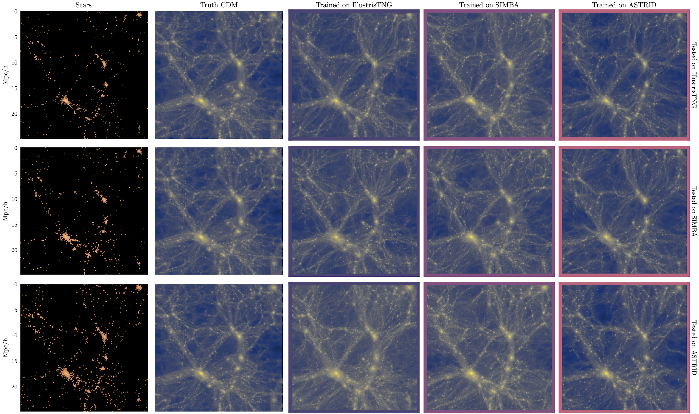

# Diffusion generative model for reconstruction of dark matter fields from galaxies

[Victoria Ono](mailto:victoriaono@college.harvard.edu), Core Francisco Park, Nayantara Mudur et al.

## Abstract

We develop a diffusion generative model to reconstruct dark matter fields from galaxies. The diffusion model is trained on the CAMELS simulation suite that contains thousands of state-of-the-art galaxy formation simulations with varying cosmological parameters and sub-grid astrophysics. We demonstrate that the diffusion model can predict the unbiased posterior distribution of the underlying dark matter fields from the given stellar mass fields, while being able to marginalize over uncertainties in cosmological and astrophysical models. 

## Dataset

The CAMELS Multifield Dataset used to train the model can be found [here](https://camels-multifield-dataset.readthedocs.io/en/latest/access.html). 

## Code overview

- The diffusion model is defined in [`model/vdm_model.py`](model/vdm_model.py), with auxiliary utilities (noise schedules, drawing figures in a logger) in [`model/utils/utils.py`](model/utils/utils.py). The model is based on the [google-research/vdm](https://github.com/google-research/vdm) repo.
- The score model is called from [`model/networks.py`](models/networks.py).
- The [`data`](data/) directory contains files for constructing the PyTorch DataLoaders for the training datasets.
- The [`notebooks`](notebooks/) directory contains notebooks used to produce results for the paper.